<!--
  Shafin Zaman — GitHub profile README.
  Put this file, dark.svg and light.svg in a repo named exactly  shafin2  (a repo whose name
  matches your username renders its README on your profile page). The <picture> below shows
  dark.svg on GitHub's dark theme and light.svg on light theme automatically.
-->

<picture>
  <source media="(prefers-color-scheme: dark)"  srcset="./dark.svg">
  <source media="(prefers-color-scheme: light)" srcset="./light.svg">
  
</picture>

 

---

### 👋 About

I'm **Shafin Zaman** — a **Full-Stack AI Engineer** in Lahore who ships whole products solo,
from the first commit to production. I'm drawn to the hard, unglamorous parts: **email
deliverability infrastructure**, the plumbing **AI agents** actually run on, and the
reliability work that makes a product usable instead of just a demo. **Available for freelance.**

- 🛰️  **Email infra** — deliverability (DMARC/DKIM/SPF), warmup & cold-email SaaS, sending microservices
- 🤖  **AI / agents** — RAG, LangGraph, **MCP** servers, vector search, grounded assistants
- 🧩  **Full-stack** — Next.js · Node/Nest · Rails · FastAPI · Postgres · MongoDB · AWS
- 🎓  B.S. Computer Science, **COMSATS** (CGPA 3.81, Silver Medalist)

### 🧠 What I'm building

My portfolio itself is an **AI-native site**: an assistant, grounded (RAG) in my real
projects, *drives* the page — and it doubles as an **MCP server** you can add to Claude or
Cursor to query my work from your own tools.

→ **[shafinzaman.dev](https://shafinzaman.dev)**  ·  `mcp: https://shafinzaman.dev/mcp`

### 📊 GitHub

<!-- Cards pull live data from GitHub; delete this block anytime if you'd rather keep it minimal. -->

### 🛠️ Stack

Have something hard to build? <a href="https://meetings-na2.hubspot.com/shafin-zaman">Let's talk →</a>

